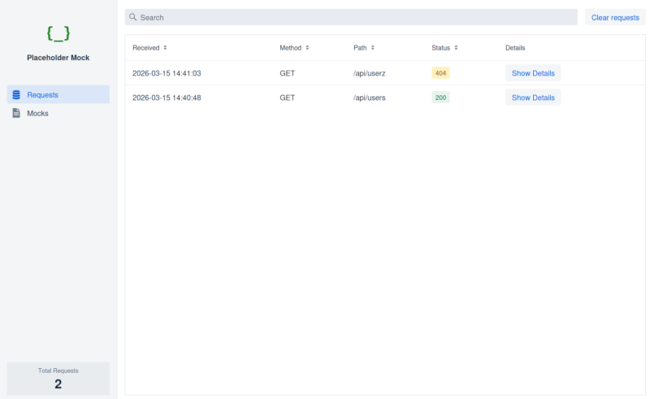

# Placeholder Mock

This is an early preview of the mocking tool Placeholder Mock.

## Build and Run

For Placeholder Mock to work a configuration file is needed. Check `mocks.json` for an example.
The location of the configuration file is passed as the `PLACEHOLDER_CONFIG_FILE` environment
variable.

Either build the project and start the *jar*:

```bash
./mvnw clean package
PLACEHOLDER_CONFIG_FILE=mocks.json java -jar target/placeholder-1.0-SNAPSHOT.jar
```

Or run in *dev mode*:
```bash
PLACEHOLDER_CONFIG_FILE=mocks.json ./mvnw
```

Once started, you can send queries:

```bash
curl -sv "http://localhost:8080/api/users"
```

Open the UI at http://localhost:8080/ to see the configured mocks and requests as they come in.


